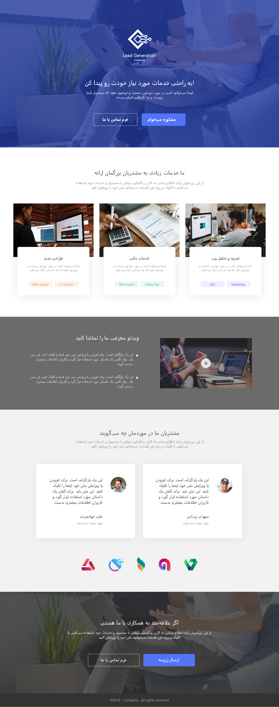

# About

> Adobe Xd to Front-end code.

## Technologies

Project is created with:

- HTML5
- CSS
- [BEM](https://css-tricks.com/bem-101/)
- [SCSS](https://sass-lang.com/)
- CSS Flexbox

## Tools Used

There are no CSS or JS libraries used for this project. However these tools have been used:

- [Parcel.js](https://parceljs.org/) as the application bundler
- Eslint as the linter
- Prettier as the code formatter
- Sass as the css preprocessor

## UI

