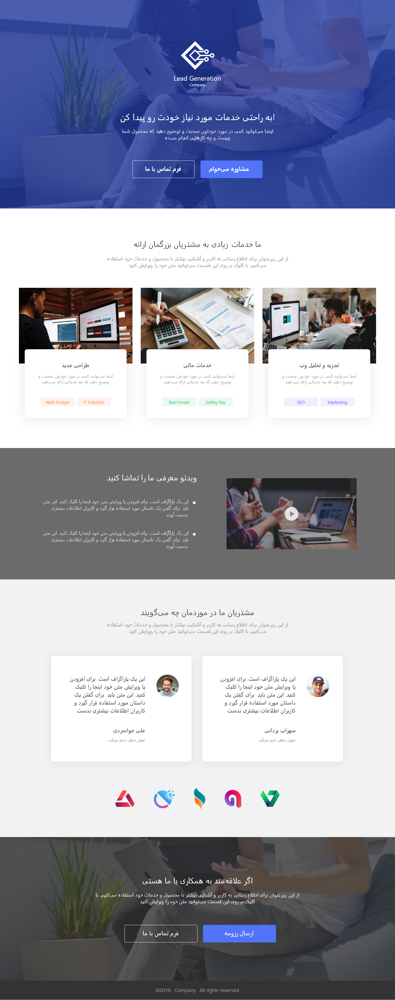
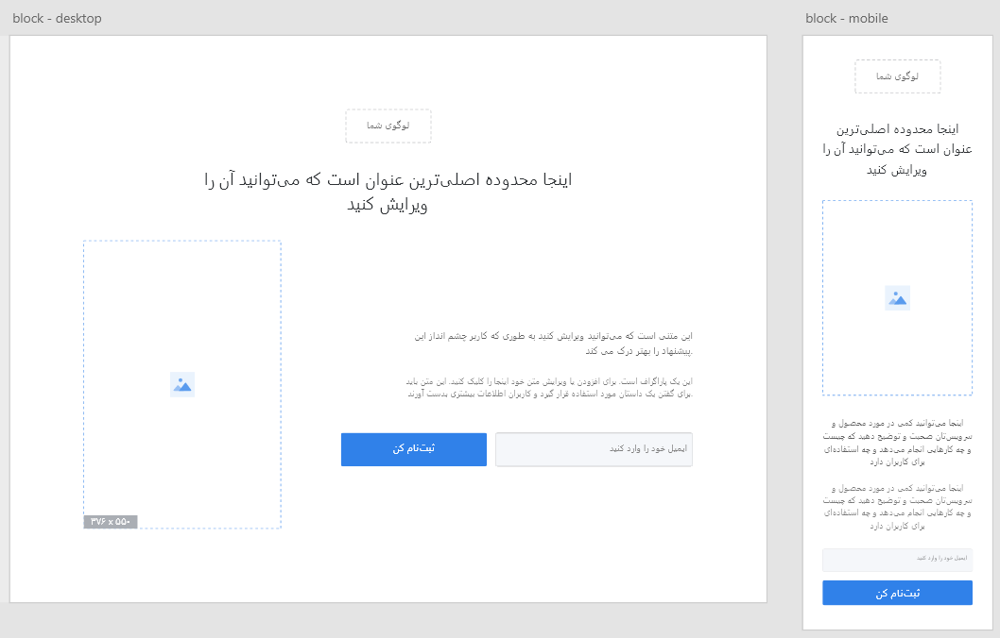

# About

> Adobe Xd to HTML and CSS (SCSS and BEM).

## Technologies

Project is created with:

- HTML5
- SVG sprite
- CSS - SCSS - BEM
- CSS Flexbox
- CSS best practices
- jQuery cache pattern
- Pure CSS! No Bootstrap and css library

## UI

- ## Block 5:

- ## Block 4:

- ## Block 3:

- ## Block 1 & 2:

For detailed explanation on how things work, checkout the [SCSS](https://sass-lang.com/), [BEM](https://css-tricks.com/bem-101/), [SVG Sprites](https://css-tricks.com/svg-sprites-use-better-icon-fonts/).